# Electron Recoil Band Simulation

 
 To simulate the bands, we need an initial **simulated** recoil energy., or "true" recoil energy. The energy is found by randomly drawning from a uniform distribution. This energy, $E_{er}$, is used to calculate the true phonon energy $pt$ and the number of electron-hole pairs produced : 

 $$ N_{e/h} = \frac{E_{er}}{\epsilon}$$
Where $\epsilon$ is the average amount of energy to create 1 electron-hole pair. 

To find the measured values for the phonon energy and charge energy, we need to account for the detector resolutions. The charge resolution is $\sigma_Q$  and the phonon resolution is $\sigma_P$.
For detector 1, Run 33.

(From note: High Threshold Analysis, 325, Dan Jardin  )

$$ \sigma_Q = \sqrt{\alpha + \beta E_{er} + \gamma E_{er}}$$
$$\alpha = 0.166, 
\beta = 0.0023,
\gamma = 9.515*10^{-5}\\
$$
$$
\alpha_p = 0.155,
\beta_p = 9.6*10^{-11},
\gamma_p = 0.0005
$$

Similar to how we find $N_{e/h}$, we smear the charge and phonon energy by the detector resolutions to find the measured quantities $Pter$ and $Q_{er}$. 

$$ pt = E_{er} + Vq_{er}\\
q_{er} = N_{e/h}\epsilon\\$$
$$
Pter = pt + randnormal(0,\sigma_P)\\
Q_{e/r} = q_{er} + randnormal(0,\sigma_Q)$$

The measured recoil energy can now be calculated. 
$$ Er_{er} = Pter + VN_{e/h}$$
We can now calculated the measured Yield, $Y$, for the detector. 
$$ Y = \frac{Q_{er}}{Er_{er}}
$$

Here is a plot of the simulated electron recoil data. The band fits shown are 1,2,3 sigma bands. 

(The fits for the bands come fromFrom note: High Threshold Analysis, 303, Rob Calkins...kinda)

To check how well the bands fit the data, we compared how much data lies within each of the 1,2,3 sigma bands. This is done by binning the data into the same spacing as in note: High Threshold Analysis, 303, Rob Calkins:

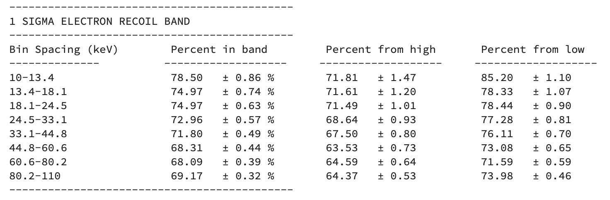

We can see that the data is not perfectly gaussian in each energy bin, and is not symmetric. This indicates that our simulated data is to narrow for low energies and to wide for higher energies. 

As noticed in the note: High Threshold Analysis, 303, by Rob Calkins, there is an asymmetry in the electron recoil data for energies above ~40keV. The antisymmetric nature of the data may be due to the fact the the mean value of the yield is slighty shifted up. In the simulation we assumed an average yield of 1, but that does not seem to be the case. (should be, not really sure what is going on)

We decided to try and shift the mean of the data by 0.01. The results are shown here: 

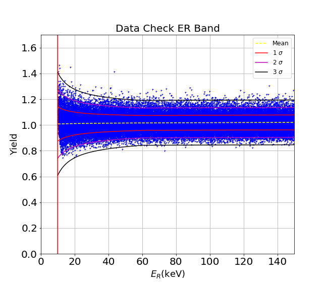

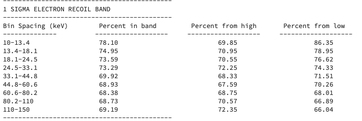
As shown, the asymmetry in the higher energy bins has seemed to go away-ish.. This did not however change anything for the bins below 33.1keV. 

## Electron Recoil Bands With Fano Factor. 

There is a variation in the number of electron-hole pairs produced for a electron recoil. To account for this, we "smear" $N_{e/h}$ with a random normal distribution with zero mean and a width defined by the Fano Factor $F$. 

$$ N_{e/h} = N_{e/h} + randnormal(0,FN_{e/h}) $$

The Fano factor for germanium is $0.13$ and $0.115$ for silicon.
The phonon energy is now dependent upon this variation in electron-hole pair production, as well as the phonon resolution.
$$ pt = E_{er} + V N_{e/h}$$

$$ \sigma_P = \sqrt{\alpha_p + \gamma_p pt^2} $$

Here the $\beta$ term has been set to zero as it is thought that the fano factor is included in that term. If not set to zero, we believe that we would be double counting $F$. Admittedly not entirely sure if thats the case. 

Here are the results from the simulation with the fano factor included (F = 0.13). As shown by the table, the asymmetry in the higher energy bins has returned. Indicating that introducing the fano factor was not the solution to this problem. 

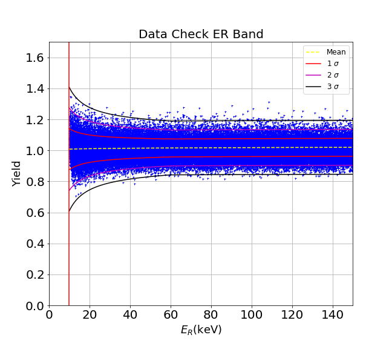
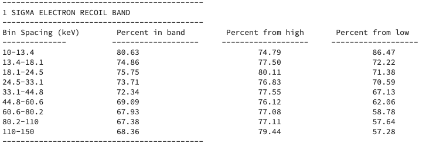

The next plot and table show the simulation run with the fano factor and the added shift of 0.01 to the mean value of the yield. As shown, the asymmetry of the upper bins has improved, but not as much as the shift without the fano factor. 

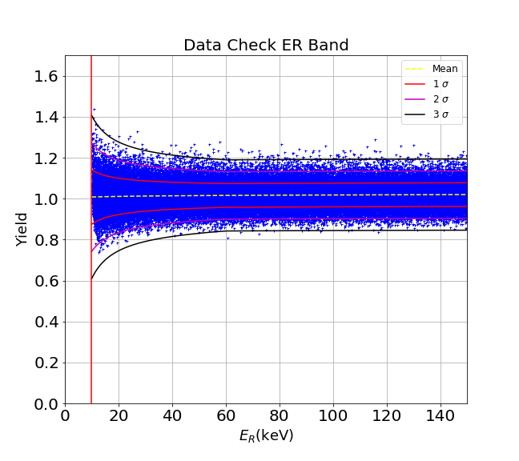
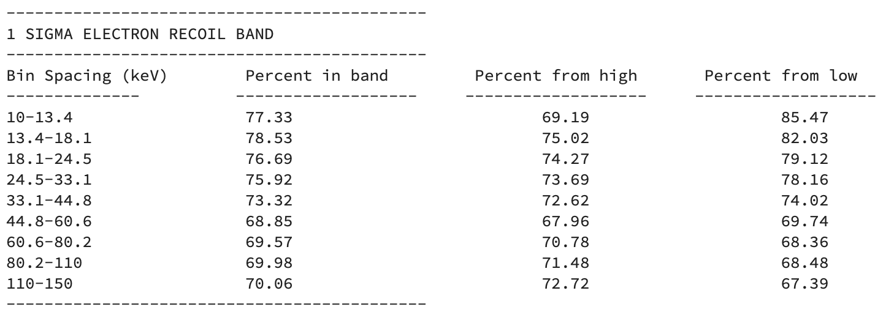

## Error In Data Check Calculations. 

Show below is a density plot of the electron recoil band, and a table showing the percent of data in each band with the associated error in each of those calculations. The error in each calculation was found by using the equations for the standard error in a binomial distribution.

$$\sigma_d = \frac{\sqrt{Npq}}{N}$$
Where $N$ is the number of trials, $p$ is the number of successes and $q$ is the number of failures, where $q = 1-p$.

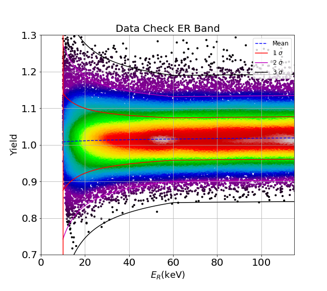
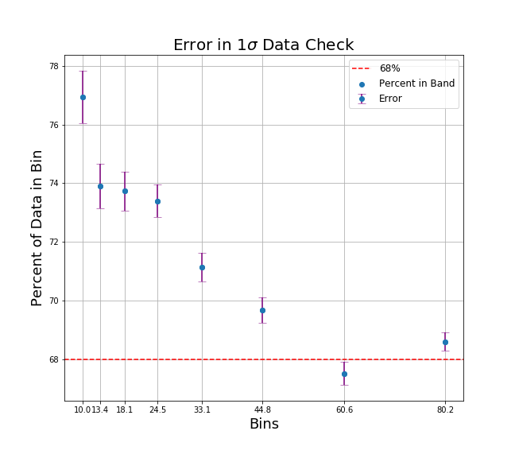

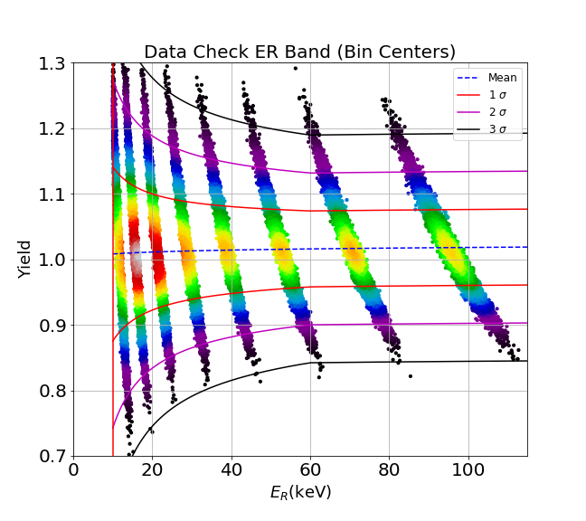
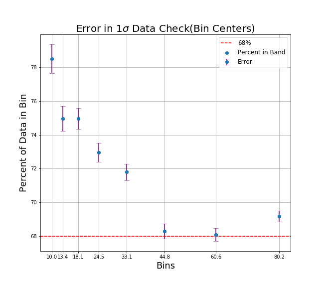
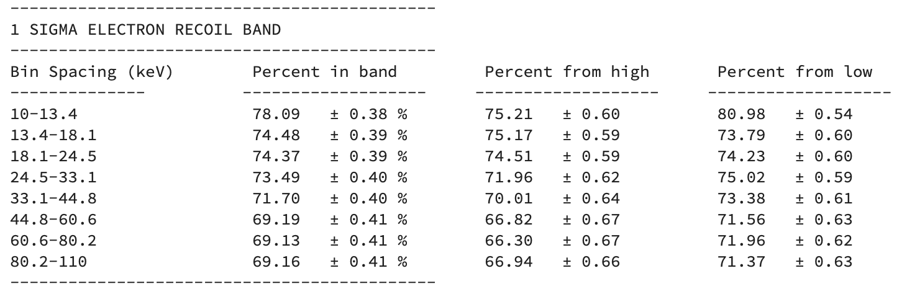

