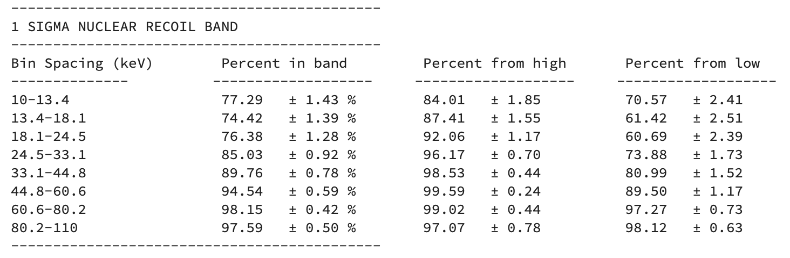
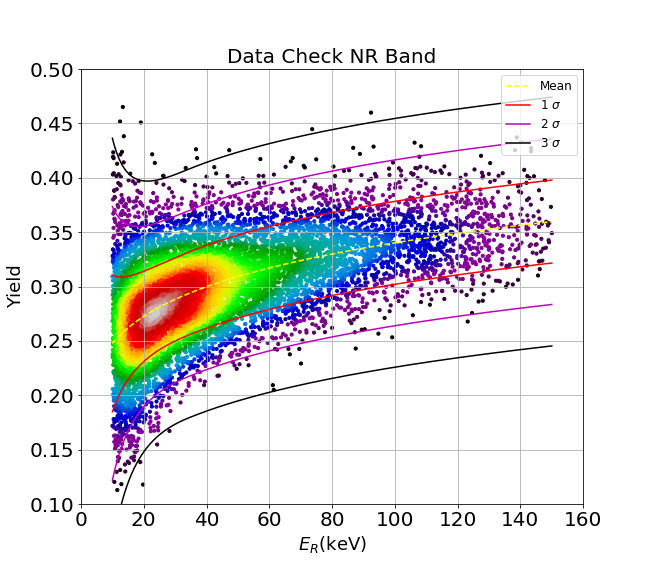
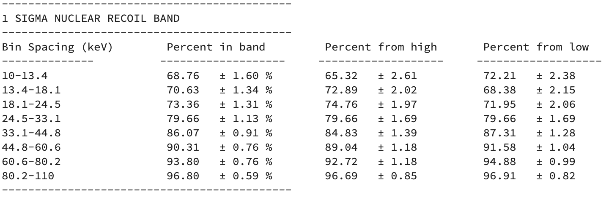
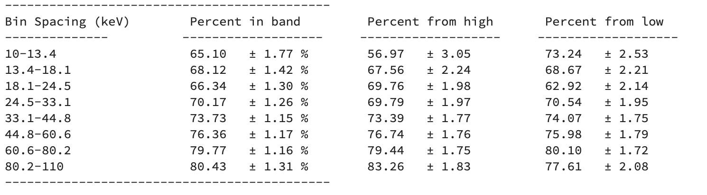

# Nuclear Recoil Band Simulation

 
 ## With Lindhard (No Fano): 
To get the **simulated** recoil energy., or "true" recoil energy. The energy is found by randomly drawing from a an exponential distribution. This energy, $E_{nr}$, is used to calculate the ionization efficency, the number of electron hole pairs produced,and the true phonon energy $ptnr$.

 For the nuclear recoil band, not all of the energy during a collision is used to create electron hole pairs. Therefore, the average amount of energy given to the electronic system (to e-h pairs) needs to be accounted for. Lindhard has a model to describe this: 

 $$Y = \frac{kg}{1+kg}$$
 $$g = 3\epsilon^{0.15} + 0.7\epsilon^{0.6} + 0.6\epsilon$$
 $$\epsilon = 11.5E_{nr}^{\frac{-7}{3}}$$

 Here $Y$ is the ionization efficiency or "**Yield**", $g$ is a parameterization and $\epsilon$ is the reduced energy. The number of electron hole pairs produced is then: 
 $$N_{eh} = Y\frac{E_{nr}}{\epsilon_{\gamma}}$$
 Here, $\epsilon_{\gamma}$ is the average amount of energy needed to create an electron hole pair. The **true** phonon and charge energy is then: 

 $$ptnr = YE_{nr}\frac{V}{\epsilon_{\gamma}} + E_{nr} = N_{eh}V + E_{nr} $$
 $$q_{nr} = YE_{nr}$$

To find the measured values for the phonon energy and charge energy, we need to account for the detector resolutions. The charge resolution is $\sigma_Q$  and the phonon resolution is $\sigma_P$.
For detector 1, Run 33.

(From note: High Threshold Analysis, 325, Dan Jardin  )

$$ \sigma_Q = \sqrt{\alpha + \beta E_{nr} + \gamma E_{nr}^2}$$
$$\alpha = 0.166, 
\beta = 0.0023,
\gamma = 9.515*10^{-5}\\
$$
$$ \sigma_P = \sqrt{\alpha_p + \beta_p E_{nr} + \gamma_p E_{nr}^2}$$
$$
\alpha_p = 0.155,
\beta_p = 9.6*10^{-11},
\gamma_p = 0.0005
$$

To find the measured values for phonon and charge energy, we smear the true phonon and charge energies with a gaussian distribution with widths defined by $\sigma_Q$ and $\sigma_P$:

$$
Ptnr = ptnr + randnormal(0,\sigma_P)\\
Q_{nr} = q_{nr} + randnormal(0,\sigma_Q)$$

The measured recoil energy can now be calculated. 
$$ Er_{nr} = Ptnr - \frac{V}{\epsilon_{\gamma}}Q_{nr}$$
Which allows us to calculate the measured Yield, $Y$, for the detector. 
$$ Y = \frac{Q_{nr}}{Er_{nr}}
$$
Shown below is a plot of the nuclear recoil band with a table of the distribution of data and the associated error (The fits for the bands come from note: High Threshold Analysis, 303, Rob Calkins...kinda):

  

When looking at the plot and table, it is obvious that there is to much data within 1 sigma. It is also apparent that mean, shown by the yellow dashed line is too high for where the data lyes. 

## Nuclear Recoil Band (With Constant Fano):

To fix the width in the recoil band, we try to include an additional constant variance, or "**fano factor**" to the simulation. The motivation for this fano factor is due to the fact that for a single nuclear recoil will not liberate the same amount of electron hole pairs every time. We account for this by adding the fano factor into the calculation for $N_{eh}$ by "smearing it" with a normal distribution with width defined by $\sqrt{N_{eh}F}$:

$$N_{eh} = \frac{YE_{nr}}{\epsilon_{\gamma}}$$
$$N_{eh} = N_{eh} + randomnormal(0,\sqrt{N_{eh}F})$$

Switching the yield model to use the average yield found from data, and then proceeding in the same manner as before and using a constant fano factor of 10, we get the following results: 

  

 

 One can see that introducing a constant fano factor only improved the spread of the data at lower energies. We believe that this is because the fano factor is probably energy dependent.

## Nuclear Recoil Band (Edelweiss Fano Factor):
For specific detail on where this fano factor came from. See Amy's note: "**edelweiss/resolutions_bandWidths**"and Anthony's notebook:"**Edw_sim_withFano.ipynb**"

The Fano factor from Edelweiss is: 

$$F = \frac{C^2}{\frac{\epsilon a}{E_{nr}^{1-b}} + \frac{2Va^2}{E_{nr}^{1-2b}}+ \frac{2*a^3}{\epsilon E_{nr}^{1-3b}}}$$
$$
a = 0.16\\
b = 0.18\\
C = 0.04
$$

 

 Though this has improved the width over all. The simulated bands are still to narrow. 